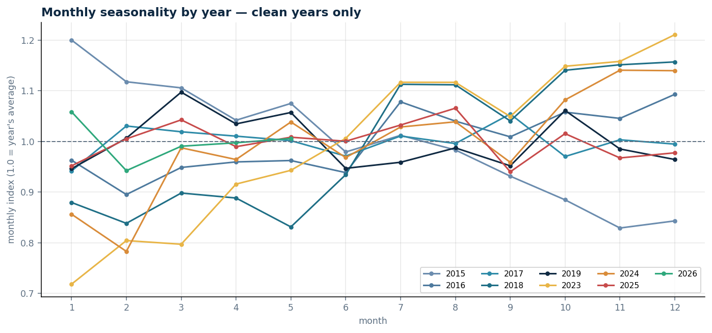
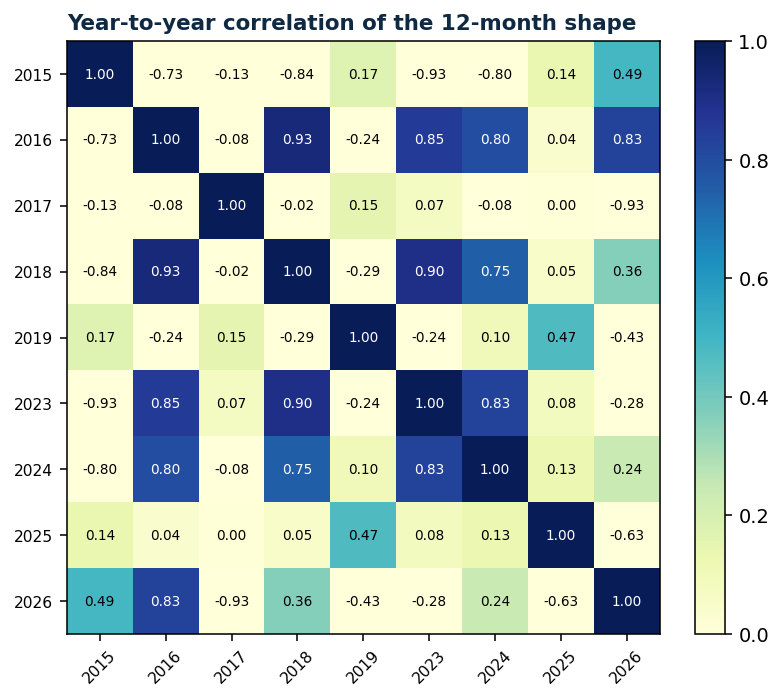
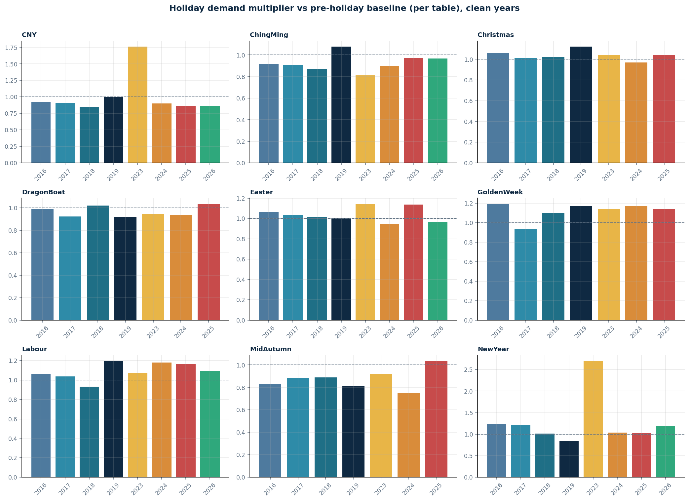
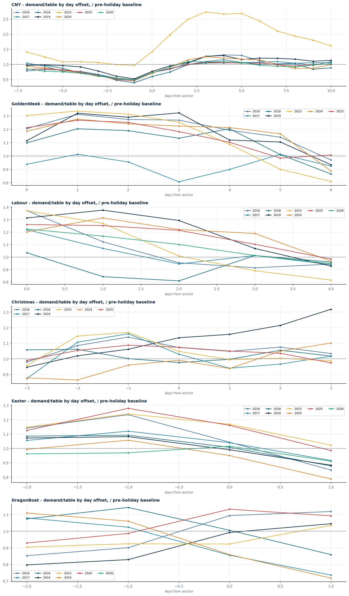
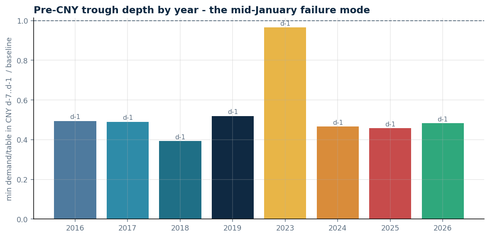
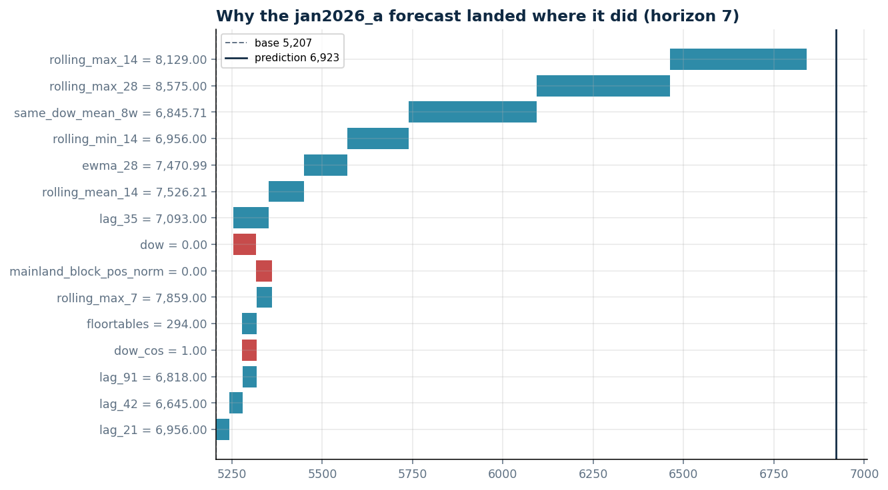
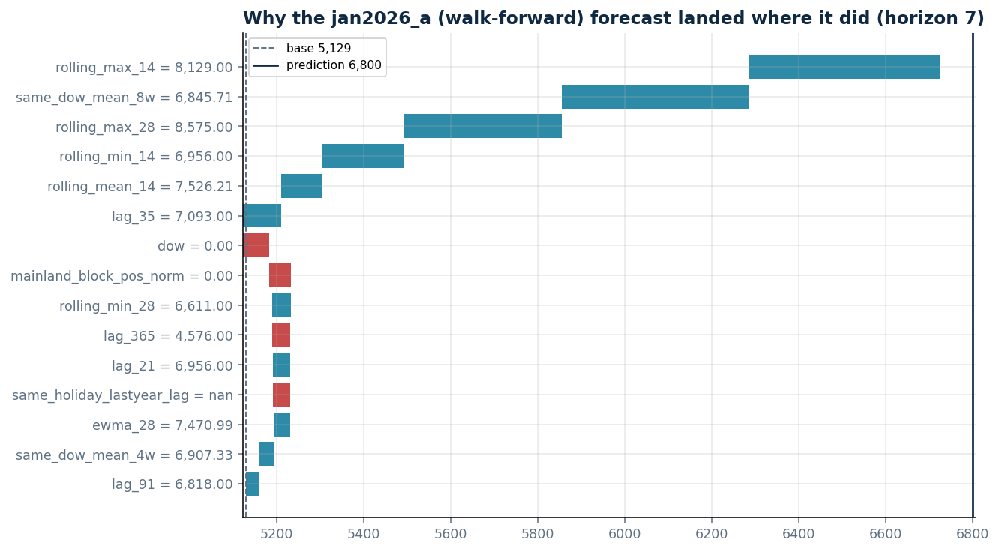

# Long-history pipeline — data exploration

Standalone analysis of the long-history data (2015-01-01 … 2026-05-28, 4,166
days) and the 174-feature engineered matrix. Regenerate with:

```
uv run python research/explore_longhistory/run_explore.py          # full
uv run python research/explore_longhistory/run_explore.py --self-check
```

All tables and charts are under `output/`. Nothing in `long_history/` or
`v2/` is touched — the engine is imported read-only.

---

## A1 Descriptive statistics

`output/stats_overall.csv`, `stats_by_year.csv`, `stats_by_dow.csv`,
`stats_by_regime.csv`, `closure_days.csv`, `per_table_by_year.png`.

The series has **no calendar gaps** and **28 zero/closure days** (Mangkhut
2018-09-16; the two COVID government closures). Overall demand averages 4,203
patron-hours/day (CV 0.50) but that number is meaningless pooled — it mixes
the pre-COVID market, the collapse, and the current one.

Cut by regime (`config.REGIMES`), demand-per-table tells the real story:

| regime | mean demand/table | CV | n days |
|---|---|---|---|
| pre_covid (…2020-01-22) | 20.0 | 0.16 | 1,848 |
| covid (2020-01-23…2022-12-31) | 4.6 | 0.75 | 1,074 |
| recovery (2023) | 16.3 | 0.21 | 365 |
| current (2024-01-01…) | 24.0 | 0.13 | 879 |

The **current regime is the most stable stretch in the whole history**
(CV 0.13) and runs ~20 % *above* the pre-COVID per-table level — the market
came back bigger per open table, not smaller. By year, per-table climbs
2023 → 2026: 16.3, 22.7, 25.2, 24.2 (2026 is partial, through May).

Day-of-week shape (per table, all years): Mon 15.5 → rising through the week
→ **Sat 18.4** (the peak) → Sun 16.8. Friday (17.1) and Saturday are clearly
the high days; Monday–Thursday are a tight band. The per-DOW CV (~0.48 each)
is inflated by the COVID zeros and is not a weekday-instability signal.

## A2 Monthly seasonality

Mean year-to-year correlation of the normalised 12-month shape: **0.048**.
Unstable months (across-year std > 0.10 index points): **Jan, Feb, Nov, Dec**.
 

**Monthly seasonality is not a stable shape across years.** The recovery
years drift *upward* through the calendar (2023: Jan index 0.72 → Dec 1.21;
2024: 0.86 → 1.14) because the business was still ramping. 2015 drifts the
other way (1.20 → 0.84). 2017, 2019 and 2025 are close to flat. So a fixed
"month" seasonal factor learned by the model is averaging over genuinely
different annual profiles.

Two caveats on the near-zero correlation: (1) the index is normalised to each
year's own mean, so it is deviations-only and small (±0.15), which makes the
correlation sensitive; (2) 2026 contributes only 5 months. The **practical**
reading is the per-month spread: mid-year months (Apr–Sep) are stable
(std < 0.08), and the four flagged months are where the model has the least
reliable calendar signal. Jan/Feb instability is largely **CNY timing** — the
holiday moves between the two months year to year, dragging the monthly mean
with it.

## A3 Holiday impact

Multiplier = mean demand in the holiday window ÷ mean demand over normal days
in the 28 days *before* the window (lead-in only; widened to 56/84 days when
fewer than 5 normal days are found). Verdict = coefficient of variation of
the per-table multiplier across clean years.

```
            n_clean_years  cv_per_table     verdict
Christmas               7      0.042      consistent
DragonBoat              7      0.046      consistent
Easter                  8      0.066      consistent
GoldenWeek              7      0.072      consistent
Labour                  8      0.075      consistent
ChingMing               8      0.080      consistent
MidAutumn               7      0.097      consistent
CNY                     8      0.285      variable
NewYear                 8      0.428      variable
```
  

**Seven of nine holidays are consistent year to year** (CV < 0.10) — their
impact is stable enough to pool across years, which is what the model's
shared holiday features assume.

**CNY and NewYear are flagged "variable", but that is one anomalous year, not
chronic instability.** The CNY per-table multiplier is 0.85–1.00 in seven of
eight clean years and **1.76 in 2023** — the recovery year, where the usual
pre-CNY softness simply did not happen and post-CNY demand was strong against
a low lead-in baseline. NewYear 2023 is 2.70 for the same reason (it is a
1-day window, so it is noisy regardless). Drop 2023 and both would read
"consistent."

The **pre-CNY trough is remarkably stable**: the minimum multiplier always
lands on **day −1** (the eve), at 0.39–0.52 in every clean year except 2023
(0.97). So the *depth and timing of the collapse* are predictable; it is the
*whole-window average* that swings, because the window (−7…+10) spans both
the collapse and the rebound and their mix shifts year to year.

## A4 COVID

`output/covid_timeline.csv`, `covid_timeline.png`.

2023 monthly per-table climbs **11.7 (Jan) → 19.7 (Dec)** — the config
comment's "recovery, non-stationary" description is exactly right. December
2023 (19.7) still falls short of the 2024-H1 norm (21.2), so
`reached_norm = False`: **2023 is recovery, not a normal year**, and belongs
outside the year-over-year comparisons (which it is). The collapse itself:
per-table 20.0 pre-COVID → 4.5 in 2020 → 3.0 in 2022, with three hard
closures inside that span.

## B1 Feature-matrix sample

`output/sample_matrix_wide.csv` (7 hand-picked days × 174 features,
transposed), `sample_matrix_tall.csv` (500 rows), `feature_dictionary.csv`.

Reading the `cny_dp1` column (target 2026-02-18, the day after CNY, at
horizon 7): the holiday machinery is fully engaged — `is_CNY = 1`,
`CNY_dp1 = 1`, `holiday_yoy_lag`/`holiday_yoy_lift` populated from CNY 2025,
`CNY_x_recent` carrying the recent level, `mainland_block_*` describing
position in the Mainland holiday block. The short lags `lag_2 … lag_6` are
**NaN by design** — at horizon 7 the engine may only use demand from 8+ days
before the target (`min_safe = h + 1`), so anything closer is gated off. This
is the load-bearing NaN behaviour the whole project relies on: LightGBM
handles it natively, and training must only ever `dropna` on `y`.

The data dictionary confirms every one of the 174 features maps to a named
group (no "other" bucket) and shows which features are sparsely populated —
e.g. the per-offset holiday flags are ~0.3 % non-null (one date per year).

## B2 Feature correlation

**304 feature pairs at |r| ≥ 0.9.** `output/corr_high_pairs.csv`,
`corr_target.csv`, `corr_group.csv`, `corr_heatmap_grouped.png`,
`corr_target.png`.

Where the redundancy lives:

| pair type | count | note |
|---|---|---|
| `short_lag` × `recency_aggregate` | 155 | rolling/EWMA windows are near-linear in their component lags |
| `recency_aggregate` × `recency_aggregate` | 109 | `rolling_mean_k` ≈ `ewma_k` (r > 0.98 across the board) |
| `short_lag` × `short_lag` | 18 | includes **8 exact duplicates**: `lag_N` ≡ `lag_anchor_N` at r = 1.00 for N ∈ {7,14,21,28,56,91,182,365} — the anchor lag resolves to the same calendar day at these horizons |
| `calendar` × `calendar` | 13 | `doy_sin` ≈ `woy_sin` (0.997), `month` ≈ `day_of_year` (0.997) |

The `lag_N` / `lag_anchor_N` exact duplication is the cleanest redundancy —
one of each pair carries no information the other lacks. **This is recorded,
not acted on** (removing features is a separate, gated decision).

Holiday-flag features correlate ~0 with everything, including the target —
expected for rare binary indicators; their value is conditional, not linear.

Top target correlations (Spearman, on trainable rows): `same_dow_mean_8w`
(0.89), `same_dow_mean_4w` (0.87), `lag_14` (0.86), `ewma_28` (0.86),
`rolling_mean_28` (0.85). Every one is a recency/lag aggregate — the model's
signal is overwhelmingly "recent level."

## B3 SHAP feature importance

Exact TreeSHAP via LightGBM `pred_contrib` (additivity verified to 1e-11).
Models trained the way the pipeline trains — `config.LGBM_PARAMS`,
holiday-upweighted sample weights, `DEFAULT_HALF_LIFE` — on the **full
history** (`as_of` = data max). This explains what the deployed model
learned; it is **not** a held-out accuracy measure.
`output/shap_importance.csv`, `shap_summary.png`.

Top 10 by mean |SHAP| (pooled over horizons 1/4/7/14/21/28):

| feature | mean \|SHAP\| |
|---|---|
| `rolling_max_28` | 261 |
| `same_dow_mean_8w` | 248 |
| `rolling_max_14` | 115 |
| `lag_2` | 101 |
| `rolling_mean_28` | 96 |
| `ewma_28` | 92 |
| `mainland_block_pos_norm` | 77 |
| `rolling_mean_14` | 70 |
| `lag_35` | 64 |
| `mainland_block_length` | 38 |

This matches the gain-based ranking in
`research/lag_holiday_features_output/feature_importance.csv` closely. One
difference: `holiday_yoy_lag` is 5th by gain but 16th by mean |SHAP| — gain
over-weights it because it is decisive on the rare holiday rows it applies
to, while mean |SHAP| across all rows dilutes that.

### Local: the mid-January 2026 forecast




Sample-day accuracy at horizon 7 (`shap_local_*` meta):

| day | actual | pred (full-history) | pred (walk-forward) |
|---|---|---|---|
| 2026-01-26 | 7,011 | 6,923 (−1.3 %) | 6,800 (−3.0 %) |
| 2026-01-29 | 7,280 | 7,306 (+0.4 %) | 7,137 (−2.0 %) |

**The mid-January-2026 under-forecast does not reproduce here.** With
walk-forward retraining at a 7-day lead — the model trained only on data up
to ~19 Jan 2026 — late-January predicts within 2–3 %.

The yearly-lookback contamination hypothesis (that `lag_365` for these dates
lands in the collapsed CNY-2025 run-up and drags the forecast down) is
**real but small**. In the walk-forward SHAP for 2026-01-26: `lag_365` =
4,576 (≈ 52 % of a normal peak — genuinely soft) contributes **−42**
patron-hours, and the whole yearly-lookback block
(`lag_365` + `lag_728` + `yoy_ratio` + `yoy_anchor_diff` +
`holiday_yoy_*` + `same_holiday_lastyear_lag`) nets to **−66**. Against a
~6,800 forecast that is under 1 %. The recency aggregates
(`rolling_max_14` +442, `same_dow_mean_8w` +430, `rolling_max_28` +363)
dominate and are correctly positive.

**Most likely explanation for the larger error originally observed:** it came
from a *fixed-window* setup (`n = 6`, no retraining), where the model is
frozen at an early cutoff and its recency features cannot track the January
run-up. That is a configuration effect, not a feature-set defect. This is
consistent with `guard_yearly_lags` (which masks exactly this ~−66 block and
is currently off in both `long_history` and `v2`): SHAP says its expected
effect is small, matching the flag's own docstring measurements.

## Notes on method / honesty

- Part A is descriptive. The only lookahead risk — the pre-holiday baseline —
  is pinned to lead-in days by `checks.py`.
- Part B2 correlations are a property of the data (trainable rows of the full
  matrix); no model, no leakage.
- Part B3 SHAP explains the fitted function on in-sample rows *by design* —
  it is an attribution of the model's own output, not a generalisation claim.
  `as_of` = data max is deliberate and disclosed; the walk-forward variant
  (`shap_local_walkforward`) is the blind-of-the-future counterpart for the
  January dates.
- **Nothing here changes the model.** The redundant `lag_N`/`lag_anchor_N`
  pairs, the variable CNY/NewYear multipliers, and the yearly-lookback
  contamination are findings for separate, gated decisions — recorded, not
  acted on.
- COVID years (2020–2022) are excluded from every year-over-year view and
  covered only in A4.
